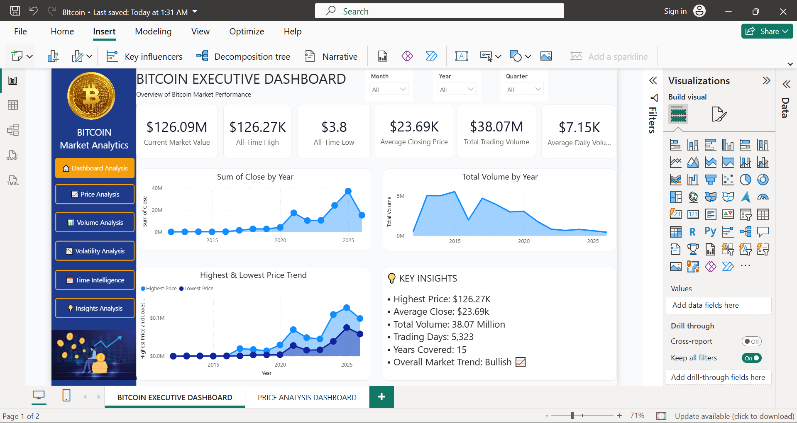

# ₿ Bitcoin Data Analysis & Power BI Dashboard

## 📊 Project Overview

This project focuses on analyzing **Bitcoin market data** using **Power BI** to identify price trends, trading volume patterns, market volatility, and time-based performance.

The dashboard transforms raw Bitcoin data into interactive business-style visualizations that help understand how Bitcoin's **price, volume, volatility, and market behavior** change over time.

---

## 🎯 Project Objectives

* Analyze Bitcoin price movements over time
* Identify high and low price periods
* Analyze trading volume trends
* Measure Bitcoin market volatility
* Identify important market insights
* Perform time-based analysis
* Create interactive Power BI dashboards
* Present complex financial data in an easy-to-understand format

---

## 🛠️ Tools & Technologies

* **Power BI**
* **Microsoft Excel / CSV**
* **DAX**
* **Data Cleaning & Transformation**
* **Data Visualization**
* **Time-Series Analysis**
* **Financial Data Analysis**

---

# 📌 Dashboard Pages

## 1. Executive Dashboard

The Executive dashboard provides a high-level overview of Bitcoin's overall market performance.

### Key Areas

* Bitcoin Price
* Trading Volume
* Market Performance
* Price Movement
* Overall Market KPIs

---

## 2. Insight Analysis

This page focuses on extracting important insights from Bitcoin market data.

### Key Analysis

* Market trends
* Price behavior
* Trading activity
* Important market movements
* Performance patterns

---

## 3. Price Analysis

The Price Analysis dashboard focuses on Bitcoin's historical price movement.

### Key Analysis

* Opening Price
* Closing Price
* High Price
* Low Price
* Price Trends
* Historical Price Movement

This analysis helps identify periods of significant Bitcoin price growth and decline.

---

## 4. Time Intelligence

The Time Intelligence dashboard analyzes Bitcoin performance across different time periods.

### Key Analysis

* Yearly trends
* Monthly trends
* Daily performance
* Period-over-period changes
* Time-based price movement

Time intelligence helps identify recurring patterns and changes in Bitcoin performance over time.

---

## 5. Volatility Analysis

Bitcoin is known for significant price fluctuations. This dashboard analyzes market volatility and identifies periods of higher and lower price variation.

### Key Analysis

* Price volatility
* Market fluctuations
* High-volatility periods
* Low-volatility periods
* Volatility trends

---

## 6. Volume Analysis

The Volume Analysis dashboard focuses on Bitcoin's trading activity.

### Key Analysis

* Trading volume
* Volume trends
* High-volume periods
* Low-volume periods
* Relationship between price and volume

Trading volume can help identify periods of increased market activity.

---

# 📈 Key Insights

The dashboard provides several useful insights into Bitcoin market behavior:

### 🔹 Price Movement

Bitcoin's price changes significantly over time, with periods of strong growth followed by corrections and declines.

### 🔹 Trading Volume

Trading volume tends to increase during periods of significant market movement, indicating stronger market participation.

### 🔹 Market Volatility

Bitcoin experiences considerable volatility, making volatility analysis important for understanding market risk.

### 🔹 Time-Based Patterns

Time intelligence provides a better understanding of how Bitcoin's performance changes across different periods.

### 🔹 Price & Volume Relationship

Comparing price movement with trading volume helps identify periods of strong buying or selling activity.

---

# 💡 Business / Analytical Value

Although Bitcoin is a financial asset, the project demonstrates several skills that are directly applicable to business analytics:

* KPI development
* Trend analysis
* Time-series analysis
* Data storytelling
* Interactive dashboard development
* Financial data visualization
* Data-driven decision making

---

# 📊 Dashboard Preview

### Executive Dashboard

### Insight Analysis

### Price Analysis

### Time Intelligence

### Volatility Analysis

### Volume Analysis

---

# 🚀 Skills Demonstrated

**Power BI | DAX | Data Analysis | Data Visualization | Time-Series Analysis | Financial Analytics | Dashboard Design | Data Storytelling**

---

# 👨‍💻 Project Purpose

This project was developed as part of a **Data Analytics / Power BI portfolio** to demonstrate the ability to transform raw Bitcoin market data into an interactive analytical dashboard.

The focus is not only on visualization, but also on extracting meaningful insights from financial data.

---

## ⭐ Conclusion

The Bitcoin Analysis Dashboard provides an interactive way to explore **price, volume, volatility, and time-based market behavior**.

It demonstrates how Power BI can be used to transform complex financial datasets into clear, interactive, and decision-supporting visualizations.
